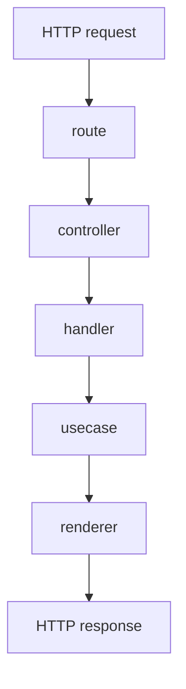

## 概要

このドキュメントでは、Web endpoint 全体に共通する処理の流れと endpoint 一覧について記載する。

## 処理の流れ

Web endpoint は `route`、`controller`、`handler`、`usecase`、`renderer` の順に処理される。

`route` は HTTP method と path を controller に対応付ける。
`controller` は Play の `Action` と共通 error handling を担当する。
`handler` は HTTP request から `UseCaseInput` を作成する。
`usecase` はアプリケーションとして実行する処理を担当する。
`renderer` は `UseCaseOutput` や usecase exception を HTTP response に変換する。

## endpoint 一覧

| method | path | 概要 |
| --- | --- | --- |
| `GET` | `/` | トップページを表示する。 |
| `GET` | `/spotify/auth/login` | Spotify 認可を開始する。 |
| `GET` | `/spotify/auth/callback` | Spotify 認可 callback を処理する。 |

## Cookie

Web endpoint では、ログイン状態の解決と Spotify 認可 callback の検証に Cookie を使用する。

Cookie 名や属性は `application/src/main/resources/application.conf` の `cookie` 設定から読み込まれる。

| 設定 | 責務 |
| --- | --- |
| `cookie.session.name` | ログイン済みユーザーを識別するための session を保持する。Spotify 認可完了後に発行され、以降の Web request でユーザーコンテキストを解決するために使う。 |
| `cookie.external-auth-state.name` | Spotify 認可開始と callback を対応づけるための一時的な state を保持する。Spotify 認可 callback の検証に使い、ログイン状態の保持には使わない。 |

session cookie はアプリケーションの session を表すものであり、Spotify access token そのものではない。

## 補足

`GET /assets/*file` は、Play Framework が `server/src/main/public` 以下の静的 asset を配信するための route である。
ユーザー操作を受け付けるアプリケーション endpoint ではないため、個別の endpoint ドキュメントは作成しない。
