# artist_release

## Description

アーティストリリース

<details>
<summary><strong>Table Definition</strong></summary>

```sql
CREATE TABLE `artist_release` (
  `id` bigint unsigned NOT NULL AUTO_INCREMENT,
  `spotify_release_code` varchar(255) COLLATE utf8mb4_unicode_ci NOT NULL COMMENT 'SpotifyリリースID',
  `source_spotify_artist_code` varchar(255) COLLATE utf8mb4_unicode_ci NOT NULL COMMENT '取得元SpotifyアーティストID',
  `release_name` varchar(1024) COLLATE utf8mb4_unicode_ci NOT NULL DEFAULT '' COMMENT 'リリース名',
  `release_type` varchar(255) COLLATE utf8mb4_unicode_ci NOT NULL DEFAULT '' COMMENT 'アプリ内リリース種別(ALBUM, EP, SINGLE)',
  `album_type` varchar(255) COLLATE utf8mb4_unicode_ci NOT NULL DEFAULT '' COMMENT 'Spotify album_type',
  `album_group` varchar(255) COLLATE utf8mb4_unicode_ci DEFAULT NULL COMMENT 'Spotify album_group',
  `spotify_release_uri` varchar(255) COLLATE utf8mb4_unicode_ci NOT NULL DEFAULT '' COMMENT 'SpotifyリリースURI',
  `spotify_url` varchar(2048) COLLATE utf8mb4_unicode_ci NOT NULL DEFAULT '' COMMENT 'Spotify URL',
  `href` varchar(2048) COLLATE utf8mb4_unicode_ci NOT NULL DEFAULT '' COMMENT 'Spotify Web API URL',
  `primary_image_url` varchar(2048) COLLATE utf8mb4_unicode_ci NOT NULL DEFAULT '' COMMENT '代表画像URL',
  `primary_image_height` int DEFAULT NULL COMMENT '代表画像高さ',
  `primary_image_width` int DEFAULT NULL COMMENT '代表画像幅',
  `images_json` json DEFAULT NULL COMMENT 'Spotify画像一覧JSON',
  `release_date_text` varchar(255) COLLATE utf8mb4_unicode_ci NOT NULL DEFAULT '' COMMENT 'リリース日文字列',
  `release_date_precision` varchar(255) COLLATE utf8mb4_unicode_ci NOT NULL DEFAULT '' COMMENT 'リリース日精度',
  `release_date_at` datetime DEFAULT NULL COMMENT 'リリース日',
  `total_tracks_count` int DEFAULT NULL COMMENT '総トラック数',
  `label_name` varchar(512) COLLATE utf8mb4_unicode_ci DEFAULT NULL COMMENT 'レーベル名',
  `normalized_label_name` varchar(255) COLLATE utf8mb4_unicode_ci DEFAULT NULL COMMENT '正規化レーベル名',
  `external_ids_json` json DEFAULT NULL COMMENT 'Spotify外部ID JSON',
  `upc_code` varchar(255) COLLATE utf8mb4_unicode_ci DEFAULT NULL COMMENT 'UPCコード',
  `ean_code` varchar(255) COLLATE utf8mb4_unicode_ci DEFAULT NULL COMMENT 'EANコード',
  `isrc_code` varchar(255) COLLATE utf8mb4_unicode_ci DEFAULT NULL COMMENT 'ISRCコード',
  `copyrights_json` json DEFAULT NULL COMMENT 'Spotify著作権情報JSON',
  `available_markets_json` json DEFAULT NULL COMMENT 'Spotify提供国一覧JSON',
  `genres_json` json DEFAULT NULL COMMENT 'Spotifyジャンル一覧JSON',
  `restrictions_json` json DEFAULT NULL COMMENT 'Spotify制限情報JSON',
  `popularity` int DEFAULT NULL COMMENT 'Spotify人気度',
  `synced_at` datetime DEFAULT NULL COMMENT '同期日時',
  `created_at` datetime NOT NULL COMMENT '作成日時',
  `updated_at` datetime NOT NULL COMMENT '更新日時',
  `deleted_at` datetime DEFAULT NULL COMMENT '削除日時',
  `created_user` varchar(255) COLLATE utf8mb4_unicode_ci NOT NULL COMMENT '作成者',
  `updated_user` varchar(255) COLLATE utf8mb4_unicode_ci NOT NULL COMMENT '更新者',
  `deleted_user` varchar(255) COLLATE utf8mb4_unicode_ci NOT NULL DEFAULT '' COMMENT '削除者',
  `deleted` bigint NOT NULL DEFAULT '0' COMMENT '論理削除フラグ(0=有効、1=無効)',
  `lock_version` bigint NOT NULL DEFAULT '0' COMMENT '楽観ロックバージョン',
  PRIMARY KEY (`id`),
  UNIQUE KEY `id` (`id`),
  UNIQUE KEY `uq_artist_release_release` (`spotify_release_code`),
  KEY `idx_artist_release_source_artist` (`source_spotify_artist_code`,`deleted`),
  KEY `idx_artist_release_release_date` (`deleted`,`release_date_at`),
  KEY `idx_artist_release_label` (`normalized_label_name`,`deleted`)
) ENGINE=InnoDB DEFAULT CHARSET=utf8mb4 COLLATE=utf8mb4_unicode_ci COMMENT='アーティストリリース'
```

</details>

## Columns

| Name | Type | Default | Nullable | Extra Definition | Children | Parents | Comment |
| ---- | ---- | ------- | -------- | ---------------- | -------- | ------- | ------- |
| id | bigint unsigned |  | false | auto_increment | [release_track](release_track.md) [user_new_release_event](user_new_release_event.md) |  |  |
| spotify_release_code | varchar(255) |  | false |  |  |  | SpotifyリリースID |
| source_spotify_artist_code | varchar(255) |  | false |  |  |  | 取得元SpotifyアーティストID |
| release_name | varchar(1024) |  | false |  |  |  | リリース名 |
| release_type | varchar(255) |  | false |  |  |  | アプリ内リリース種別(ALBUM, EP, SINGLE) |
| album_type | varchar(255) |  | false |  |  |  | Spotify album_type |
| album_group | varchar(255) |  | true |  |  |  | Spotify album_group |
| spotify_release_uri | varchar(255) |  | false |  |  |  | SpotifyリリースURI |
| spotify_url | varchar(2048) |  | false |  |  |  | Spotify URL |
| href | varchar(2048) |  | false |  |  |  | Spotify Web API URL |
| primary_image_url | varchar(2048) |  | false |  |  |  | 代表画像URL |
| primary_image_height | int |  | true |  |  |  | 代表画像高さ |
| primary_image_width | int |  | true |  |  |  | 代表画像幅 |
| images_json | json |  | true |  |  |  | Spotify画像一覧JSON |
| release_date_text | varchar(255) |  | false |  |  |  | リリース日文字列 |
| release_date_precision | varchar(255) |  | false |  |  |  | リリース日精度 |
| release_date_at | datetime |  | true |  |  |  | リリース日 |
| total_tracks_count | int |  | true |  |  |  | 総トラック数 |
| label_name | varchar(512) |  | true |  |  |  | レーベル名 |
| normalized_label_name | varchar(255) |  | true |  |  |  | 正規化レーベル名 |
| external_ids_json | json |  | true |  |  |  | Spotify外部ID JSON |
| upc_code | varchar(255) |  | true |  |  |  | UPCコード |
| ean_code | varchar(255) |  | true |  |  |  | EANコード |
| isrc_code | varchar(255) |  | true |  |  |  | ISRCコード |
| copyrights_json | json |  | true |  |  |  | Spotify著作権情報JSON |
| available_markets_json | json |  | true |  |  |  | Spotify提供国一覧JSON |
| genres_json | json |  | true |  |  |  | Spotifyジャンル一覧JSON |
| restrictions_json | json |  | true |  |  |  | Spotify制限情報JSON |
| popularity | int |  | true |  |  |  | Spotify人気度 |
| synced_at | datetime |  | true |  |  |  | 同期日時 |
| created_at | datetime |  | false |  |  |  | 作成日時 |
| updated_at | datetime |  | false |  |  |  | 更新日時 |
| deleted_at | datetime |  | true |  |  |  | 削除日時 |
| created_user | varchar(255) |  | false |  |  |  | 作成者 |
| updated_user | varchar(255) |  | false |  |  |  | 更新者 |
| deleted_user | varchar(255) |  | false |  |  |  | 削除者 |
| deleted | bigint | 0 | false |  |  |  | 論理削除フラグ(0=有効、1=無効) |
| lock_version | bigint | 0 | false |  |  |  | 楽観ロックバージョン |

## Constraints

| Name | Type | Definition |
| ---- | ---- | ---------- |
| id | UNIQUE | UNIQUE KEY id (id) |
| PRIMARY | PRIMARY KEY | PRIMARY KEY (id) |
| uq_artist_release_release | UNIQUE | UNIQUE KEY uq_artist_release_release (spotify_release_code) |

## Indexes

| Name | Definition |
| ---- | ---------- |
| idx_artist_release_label | KEY idx_artist_release_label (normalized_label_name, deleted) USING BTREE |
| idx_artist_release_release_date | KEY idx_artist_release_release_date (deleted, release_date_at) USING BTREE |
| idx_artist_release_source_artist | KEY idx_artist_release_source_artist (source_spotify_artist_code, deleted) USING BTREE |
| PRIMARY | PRIMARY KEY (id) USING BTREE |
| id | UNIQUE KEY id (id) USING BTREE |
| uq_artist_release_release | UNIQUE KEY uq_artist_release_release (spotify_release_code) USING BTREE |

## Relations

```mermaid
erDiagram

"release_track" }o--|| "artist_release" : ""
"user_new_release_event" }o--|| "artist_release" : ""
"user_new_release_notification_queue" }o--|| "user_new_release_event" : ""
"user_new_release_event" }o--|| "user" : ""

"artist_release" {
  bigint_unsigned id PK ""
  varchar_255_ spotify_release_code "SpotifyリリースID"
  varchar_255_ source_spotify_artist_code "取得元SpotifyアーティストID"
  varchar_1024_ release_name "リリース名"
  varchar_255_ release_type "アプリ内リリース種別(ALBUM, EP, SINGLE)"
  varchar_255_ album_type "Spotify album_type"
  varchar_255_ album_group "Spotify album_group"
  varchar_255_ spotify_release_uri "SpotifyリリースURI"
  varchar_2048_ spotify_url "Spotify URL"
  varchar_2048_ href "Spotify Web API URL"
  varchar_2048_ primary_image_url "代表画像URL"
  int primary_image_height "代表画像高さ"
  int primary_image_width "代表画像幅"
  json images_json "Spotify画像一覧JSON"
  varchar_255_ release_date_text "リリース日文字列"
  varchar_255_ release_date_precision "リリース日精度"
  datetime release_date_at "リリース日"
  int total_tracks_count "総トラック数"
  varchar_512_ label_name "レーベル名"
  varchar_255_ normalized_label_name "正規化レーベル名"
  json external_ids_json "Spotify外部ID JSON"
  varchar_255_ upc_code "UPCコード"
  varchar_255_ ean_code "EANコード"
  varchar_255_ isrc_code "ISRCコード"
  json copyrights_json "Spotify著作権情報JSON"
  json available_markets_json "Spotify提供国一覧JSON"
  json genres_json "Spotifyジャンル一覧JSON"
  json restrictions_json "Spotify制限情報JSON"
  int popularity "Spotify人気度"
  datetime synced_at "同期日時"
  datetime created_at "作成日時"
  datetime updated_at "更新日時"
  datetime deleted_at "削除日時"
  varchar_255_ created_user "作成者"
  varchar_255_ updated_user "更新者"
  varchar_255_ deleted_user "削除者"
  bigint deleted "論理削除フラグ(0=有効、1=無効)"
  bigint lock_version "楽観ロックバージョン"
}
"release_track" {
  bigint_unsigned id PK ""
  bigint_unsigned artist_release_id FK "アーティストリリースID"
  varchar_255_ spotify_track_code "SpotifyトラックID"
  varchar_1024_ track_name "トラック名"
  varchar_255_ spotify_track_uri "SpotifyトラックURI"
  varchar_2048_ spotify_url "Spotify URL"
  varchar_2048_ href "Spotify Web API URL"
  int disc_number "ディスク番号"
  int track_number "トラック番号"
  int duration_ms "再生時間ミリ秒"
  bigint explicit "Explicitフラグ(0=無効、1=有効)"
  bigint is_playable "再生可能フラグ(0=無効、1=有効)"
  bigint is_local "ローカルトラックフラグ(0=無効、1=有効)"
  varchar_255_ linked_from_spotify_track_code "置換元SpotifyトラックID"
  varchar_255_ linked_from_spotify_track_uri "置換元SpotifyトラックURI"
  varchar_2048_ preview_url "SpotifyプレビューURL"
  json external_ids_json "Spotify外部ID JSON"
  varchar_255_ isrc_code "ISRCコード"
  varchar_255_ ean_code "EANコード"
  varchar_255_ upc_code "UPCコード"
  json available_markets_json "Spotify提供国一覧JSON"
  json restrictions_json "Spotify制限情報JSON"
  int popularity "Spotify人気度"
  datetime synced_at "同期日時"
  datetime created_at "作成日時"
  datetime updated_at "更新日時"
  datetime deleted_at "削除日時"
  varchar_255_ created_user "作成者"
  varchar_255_ updated_user "更新者"
  varchar_255_ deleted_user "削除者"
  bigint deleted "論理削除フラグ(0=有効、1=無効)"
  bigint lock_version "楽観ロックバージョン"
}
"user_new_release_event" {
  bigint_unsigned id PK ""
  bigint_unsigned user_id FK "ユーザーID"
  bigint_unsigned artist_release_id FK "アーティストリリースID"
  varchar_255_ spotify_release_code "SpotifyリリースID"
  varchar_255_ source_spotify_artist_code "取得元SpotifyアーティストID"
  datetime detected_at "新着検出日時"
  varchar_255_ detection_sync_code "検出同期コード"
  datetime created_at "作成日時"
  datetime updated_at "更新日時"
  datetime deleted_at "削除日時"
  varchar_255_ created_user "作成者"
  varchar_255_ updated_user "更新者"
  varchar_255_ deleted_user "削除者"
  bigint deleted "論理削除フラグ(0=有効、1=無効)"
  bigint lock_version "楽観ロックバージョン"
}
"user_new_release_notification_queue" {
  bigint_unsigned id PK ""
  bigint_unsigned user_new_release_event_id FK "ユーザー別新着リリース履歴ID"
  varchar_255_ release_notification_type "リリース通知種別(PLAYLIST)"
  bigint_unsigned playlist_setting_id FK "ユーザープレイリスト設定ID"
  varchar_255_ status "キュー状態(SCHEDULED, PROCESSING, SUCCEEDED, FAILED, BLOCKED, SKIPPED)"
  datetime next_attempt_at "次回試行日時"
  int attempt_count "試行回数"
  datetime last_failed_at "最終失敗日時"
  varchar_255_ last_error_type "最終エラー種別"
  varchar_255_ lock_token "処理ロックトークン"
  datetime locked_until "処理ロック期限"
  datetime last_attempted_at "最終試行日時"
  datetime completed_at "処理完了日時"
  varchar_255_ spotify_snapshot_id "SpotifyプレイリストスナップショットID"
  datetime created_at "作成日時"
  datetime updated_at "更新日時"
  datetime deleted_at "削除日時"
  varchar_255_ created_user "作成者"
  varchar_255_ updated_user "更新者"
  varchar_255_ deleted_user "削除者"
  bigint deleted "論理削除フラグ(0=有効、1=無効)"
  bigint lock_version "楽観ロックバージョン"
}
"user" {
  bigint_unsigned id PK ""
  varchar_255_ user_name "ユーザー名"
  varchar_255_ display_name "表示名"
  varchar_255_ time_zone "タイムゾーン"
  bigint enabled "有効フラグ(0=無効、1=有効)"
  datetime created_at "作成日時"
  datetime updated_at "更新日時"
  datetime deleted_at "削除日時"
  varchar_255_ created_user "作成者"
  varchar_255_ updated_user "更新者"
  varchar_255_ deleted_user "削除者"
  bigint deleted "論理削除フラグ(0=有効、1=無効)"
  bigint lock_version "楽観ロックバージョン"
}
```



---

> Generated by [tbls](https://github.com/k1LoW/tbls)
