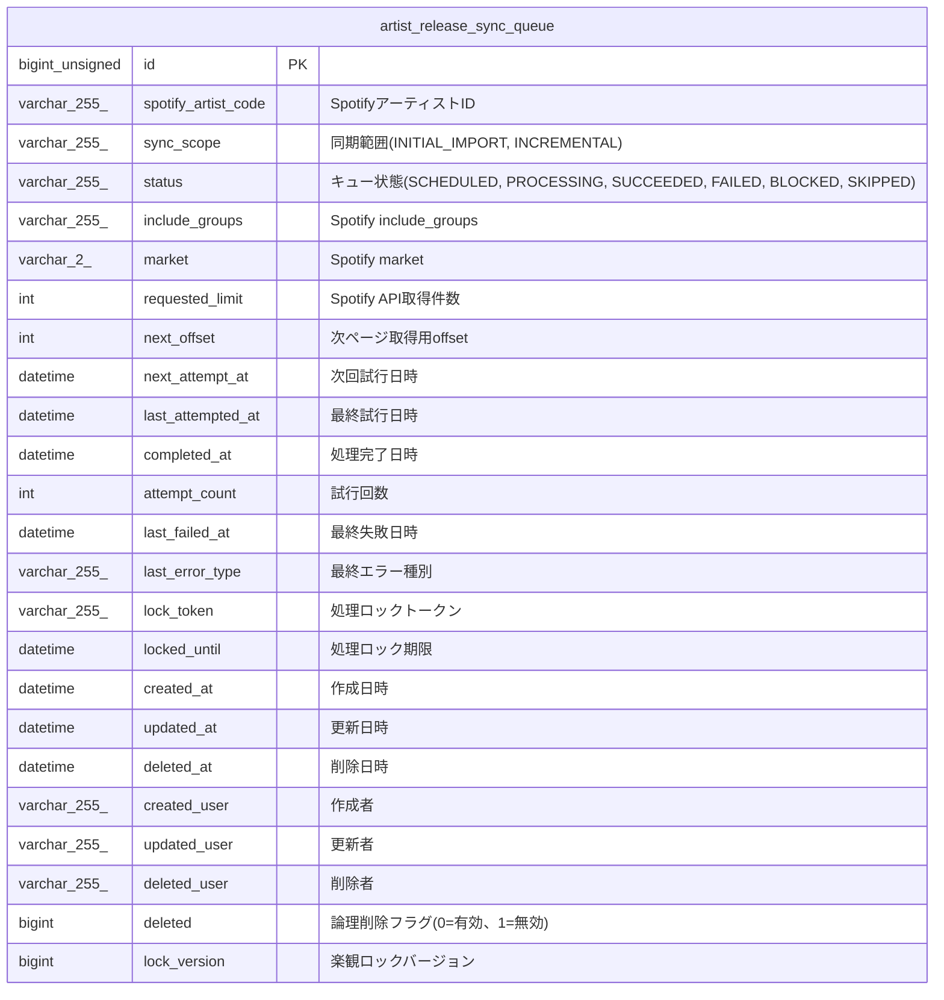

# artist_release_sync_queue

## Description

アーティストリリース同期キュー

<details>
<summary><strong>Table Definition</strong></summary>

```sql
CREATE TABLE `artist_release_sync_queue` (
  `id` bigint unsigned NOT NULL AUTO_INCREMENT,
  `spotify_artist_code` varchar(255) COLLATE utf8mb4_unicode_ci NOT NULL COMMENT 'SpotifyアーティストID',
  `sync_scope` varchar(255) COLLATE utf8mb4_unicode_ci NOT NULL DEFAULT 'INCREMENTAL' COMMENT '同期範囲(INITIAL_IMPORT, INCREMENTAL)',
  `status` varchar(255) COLLATE utf8mb4_unicode_ci NOT NULL DEFAULT 'SCHEDULED' COMMENT 'キュー状態(SCHEDULED, PROCESSING, SUCCEEDED, FAILED, BLOCKED, SKIPPED)',
  `include_groups` varchar(255) COLLATE utf8mb4_unicode_ci NOT NULL DEFAULT 'album,single' COMMENT 'Spotify include_groups',
  `market` varchar(2) COLLATE utf8mb4_unicode_ci DEFAULT NULL COMMENT 'Spotify market',
  `requested_limit` int NOT NULL DEFAULT '10' COMMENT 'Spotify API取得件数',
  `next_offset` int NOT NULL DEFAULT '0' COMMENT '次ページ取得用offset',
  `next_attempt_at` datetime DEFAULT NULL COMMENT '次回試行日時',
  `last_attempted_at` datetime DEFAULT NULL COMMENT '最終試行日時',
  `completed_at` datetime DEFAULT NULL COMMENT '処理完了日時',
  `attempt_count` int NOT NULL DEFAULT '0' COMMENT '試行回数',
  `last_failed_at` datetime DEFAULT NULL COMMENT '最終失敗日時',
  `last_error_type` varchar(255) COLLATE utf8mb4_unicode_ci NOT NULL DEFAULT '' COMMENT '最終エラー種別',
  `lock_token` varchar(255) COLLATE utf8mb4_unicode_ci NOT NULL DEFAULT '' COMMENT '処理ロックトークン',
  `locked_until` datetime DEFAULT NULL COMMENT '処理ロック期限',
  `created_at` datetime NOT NULL COMMENT '作成日時',
  `updated_at` datetime NOT NULL COMMENT '更新日時',
  `deleted_at` datetime DEFAULT NULL COMMENT '削除日時',
  `created_user` varchar(255) COLLATE utf8mb4_unicode_ci NOT NULL COMMENT '作成者',
  `updated_user` varchar(255) COLLATE utf8mb4_unicode_ci NOT NULL COMMENT '更新者',
  `deleted_user` varchar(255) COLLATE utf8mb4_unicode_ci NOT NULL DEFAULT '' COMMENT '削除者',
  `deleted` bigint NOT NULL DEFAULT '0' COMMENT '論理削除フラグ(0=有効、1=無効)',
  `lock_version` bigint NOT NULL DEFAULT '0' COMMENT '楽観ロックバージョン',
  PRIMARY KEY (`id`),
  UNIQUE KEY `id` (`id`),
  UNIQUE KEY `uq_artist_release_sync_queue_artist_scope` (`spotify_artist_code`,`sync_scope`),
  KEY `idx_artist_release_sync_queue_target` (`deleted`,`status`,`next_attempt_at`,`locked_until`,`id`)
) ENGINE=InnoDB DEFAULT CHARSET=utf8mb4 COLLATE=utf8mb4_unicode_ci COMMENT='アーティストリリース同期キュー'
```

</details>

## Columns

| Name | Type | Default | Nullable | Extra Definition | Children | Parents | Comment |
| ---- | ---- | ------- | -------- | ---------------- | -------- | ------- | ------- |
| id | bigint unsigned |  | false | auto_increment |  |  |  |
| spotify_artist_code | varchar(255) |  | false |  |  |  | SpotifyアーティストID |
| sync_scope | varchar(255) | INCREMENTAL | false |  |  |  | 同期範囲(INITIAL_IMPORT, INCREMENTAL) |
| status | varchar(255) | SCHEDULED | false |  |  |  | キュー状態(SCHEDULED, PROCESSING, SUCCEEDED, FAILED, BLOCKED, SKIPPED) |
| include_groups | varchar(255) | album,single | false |  |  |  | Spotify include_groups |
| market | varchar(2) |  | true |  |  |  | Spotify market |
| requested_limit | int | 10 | false |  |  |  | Spotify API取得件数 |
| next_offset | int | 0 | false |  |  |  | 次ページ取得用offset |
| next_attempt_at | datetime |  | true |  |  |  | 次回試行日時 |
| last_attempted_at | datetime |  | true |  |  |  | 最終試行日時 |
| completed_at | datetime |  | true |  |  |  | 処理完了日時 |
| attempt_count | int | 0 | false |  |  |  | 試行回数 |
| last_failed_at | datetime |  | true |  |  |  | 最終失敗日時 |
| last_error_type | varchar(255) |  | false |  |  |  | 最終エラー種別 |
| lock_token | varchar(255) |  | false |  |  |  | 処理ロックトークン |
| locked_until | datetime |  | true |  |  |  | 処理ロック期限 |
| created_at | datetime |  | false |  |  |  | 作成日時 |
| updated_at | datetime |  | false |  |  |  | 更新日時 |
| deleted_at | datetime |  | true |  |  |  | 削除日時 |
| created_user | varchar(255) |  | false |  |  |  | 作成者 |
| updated_user | varchar(255) |  | false |  |  |  | 更新者 |
| deleted_user | varchar(255) |  | false |  |  |  | 削除者 |
| deleted | bigint | 0 | false |  |  |  | 論理削除フラグ(0=有効、1=無効) |
| lock_version | bigint | 0 | false |  |  |  | 楽観ロックバージョン |

## Constraints

| Name | Type | Definition |
| ---- | ---- | ---------- |
| id | UNIQUE | UNIQUE KEY id (id) |
| PRIMARY | PRIMARY KEY | PRIMARY KEY (id) |
| uq_artist_release_sync_queue_artist_scope | UNIQUE | UNIQUE KEY uq_artist_release_sync_queue_artist_scope (spotify_artist_code, sync_scope) |

## Indexes

| Name | Definition |
| ---- | ---------- |
| idx_artist_release_sync_queue_target | KEY idx_artist_release_sync_queue_target (deleted, status, next_attempt_at, locked_until, id) USING BTREE |
| PRIMARY | PRIMARY KEY (id) USING BTREE |
| id | UNIQUE KEY id (id) USING BTREE |
| uq_artist_release_sync_queue_artist_scope | UNIQUE KEY uq_artist_release_sync_queue_artist_scope (spotify_artist_code, sync_scope) USING BTREE |

## Relations



---

> Generated by [tbls](https://github.com/k1LoW/tbls)
