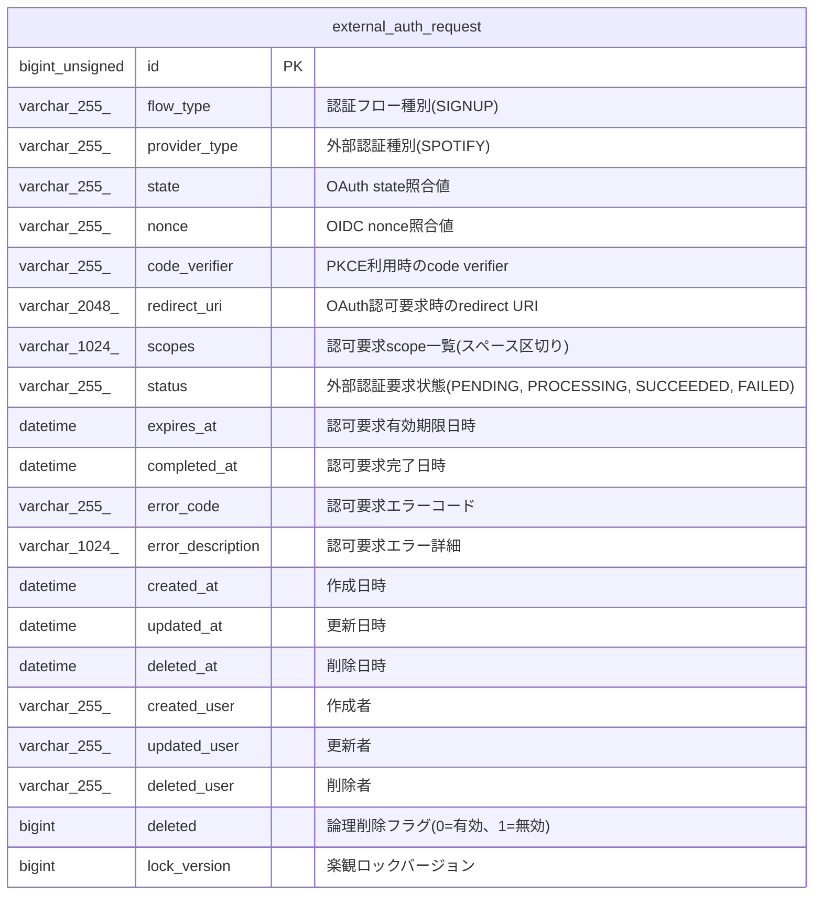

# external_auth_request

## Description

外部認証要求

<details>
<summary><strong>Table Definition</strong></summary>

```sql
CREATE TABLE `external_auth_request` (
  `id` bigint unsigned NOT NULL AUTO_INCREMENT,
  `flow_type` varchar(255) COLLATE utf8mb4_unicode_ci NOT NULL COMMENT '認証フロー種別(SIGNUP)',
  `provider_type` varchar(255) COLLATE utf8mb4_unicode_ci NOT NULL COMMENT '外部認証種別(SPOTIFY)',
  `state` varchar(255) COLLATE utf8mb4_unicode_ci NOT NULL COMMENT 'OAuth state照合値',
  `nonce` varchar(255) COLLATE utf8mb4_unicode_ci NOT NULL COMMENT 'OIDC nonce照合値',
  `code_verifier` varchar(255) COLLATE utf8mb4_unicode_ci DEFAULT NULL COMMENT 'PKCE利用時のcode verifier',
  `redirect_uri` varchar(2048) COLLATE utf8mb4_unicode_ci NOT NULL COMMENT 'OAuth認可要求時のredirect URI',
  `scopes` varchar(1024) COLLATE utf8mb4_unicode_ci NOT NULL COMMENT '認可要求scope一覧(スペース区切り)',
  `status` varchar(255) COLLATE utf8mb4_unicode_ci NOT NULL DEFAULT 'PENDING' COMMENT '外部認証要求状態(PENDING, PROCESSING, SUCCEEDED, FAILED)',
  `expires_at` datetime NOT NULL COMMENT '認可要求有効期限日時',
  `completed_at` datetime DEFAULT NULL COMMENT '認可要求完了日時',
  `error_code` varchar(255) COLLATE utf8mb4_unicode_ci DEFAULT NULL COMMENT '認可要求エラーコード',
  `error_description` varchar(1024) COLLATE utf8mb4_unicode_ci DEFAULT NULL COMMENT '認可要求エラー詳細',
  `created_at` datetime NOT NULL COMMENT '作成日時',
  `updated_at` datetime NOT NULL COMMENT '更新日時',
  `deleted_at` datetime DEFAULT NULL COMMENT '削除日時',
  `created_user` varchar(255) COLLATE utf8mb4_unicode_ci NOT NULL COMMENT '作成者',
  `updated_user` varchar(255) COLLATE utf8mb4_unicode_ci NOT NULL COMMENT '更新者',
  `deleted_user` varchar(255) COLLATE utf8mb4_unicode_ci NOT NULL DEFAULT '' COMMENT '削除者',
  `deleted` bigint NOT NULL DEFAULT '0' COMMENT '論理削除フラグ(0=有効、1=無効)',
  `lock_version` bigint NOT NULL DEFAULT '0' COMMENT '楽観ロックバージョン',
  PRIMARY KEY (`id`),
  UNIQUE KEY `id` (`id`),
  UNIQUE KEY `uq_external_auth_request_state` (`state`),
  KEY `idx_external_auth_request_flow_provider` (`flow_type`,`provider_type`),
  KEY `idx_external_auth_request_status` (`status`),
  KEY `idx_external_auth_request_expires_at` (`expires_at`),
  KEY `idx_external_auth_request_completed_at` (`completed_at`)
) ENGINE=InnoDB DEFAULT CHARSET=utf8mb4 COLLATE=utf8mb4_unicode_ci COMMENT='外部認証要求'
```

</details>

## Columns

| Name | Type | Default | Nullable | Extra Definition | Children | Parents | Comment |
| ---- | ---- | ------- | -------- | ---------------- | -------- | ------- | ------- |
| id | bigint unsigned |  | false | auto_increment |  |  |  |
| flow_type | varchar(255) |  | false |  |  |  | 認証フロー種別(SIGNUP) |
| provider_type | varchar(255) |  | false |  |  |  | 外部認証種別(SPOTIFY) |
| state | varchar(255) |  | false |  |  |  | OAuth state照合値 |
| nonce | varchar(255) |  | false |  |  |  | OIDC nonce照合値 |
| code_verifier | varchar(255) |  | true |  |  |  | PKCE利用時のcode verifier |
| redirect_uri | varchar(2048) |  | false |  |  |  | OAuth認可要求時のredirect URI |
| scopes | varchar(1024) |  | false |  |  |  | 認可要求scope一覧(スペース区切り) |
| status | varchar(255) | PENDING | false |  |  |  | 外部認証要求状態(PENDING, PROCESSING, SUCCEEDED, FAILED) |
| expires_at | datetime |  | false |  |  |  | 認可要求有効期限日時 |
| completed_at | datetime |  | true |  |  |  | 認可要求完了日時 |
| error_code | varchar(255) |  | true |  |  |  | 認可要求エラーコード |
| error_description | varchar(1024) |  | true |  |  |  | 認可要求エラー詳細 |
| created_at | datetime |  | false |  |  |  | 作成日時 |
| updated_at | datetime |  | false |  |  |  | 更新日時 |
| deleted_at | datetime |  | true |  |  |  | 削除日時 |
| created_user | varchar(255) |  | false |  |  |  | 作成者 |
| updated_user | varchar(255) |  | false |  |  |  | 更新者 |
| deleted_user | varchar(255) |  | false |  |  |  | 削除者 |
| deleted | bigint | 0 | false |  |  |  | 論理削除フラグ(0=有効、1=無効) |
| lock_version | bigint | 0 | false |  |  |  | 楽観ロックバージョン |

## Constraints

| Name | Type | Definition |
| ---- | ---- | ---------- |
| id | UNIQUE | UNIQUE KEY id (id) |
| PRIMARY | PRIMARY KEY | PRIMARY KEY (id) |
| uq_external_auth_request_state | UNIQUE | UNIQUE KEY uq_external_auth_request_state (state) |

## Indexes

| Name | Definition |
| ---- | ---------- |
| idx_external_auth_request_completed_at | KEY idx_external_auth_request_completed_at (completed_at) USING BTREE |
| idx_external_auth_request_expires_at | KEY idx_external_auth_request_expires_at (expires_at) USING BTREE |
| idx_external_auth_request_flow_provider | KEY idx_external_auth_request_flow_provider (flow_type, provider_type) USING BTREE |
| idx_external_auth_request_status | KEY idx_external_auth_request_status (status) USING BTREE |
| PRIMARY | PRIMARY KEY (id) USING BTREE |
| id | UNIQUE KEY id (id) USING BTREE |
| uq_external_auth_request_state | UNIQUE KEY uq_external_auth_request_state (state) USING BTREE |

## Relations



---

> Generated by [tbls](https://github.com/k1LoW/tbls)
