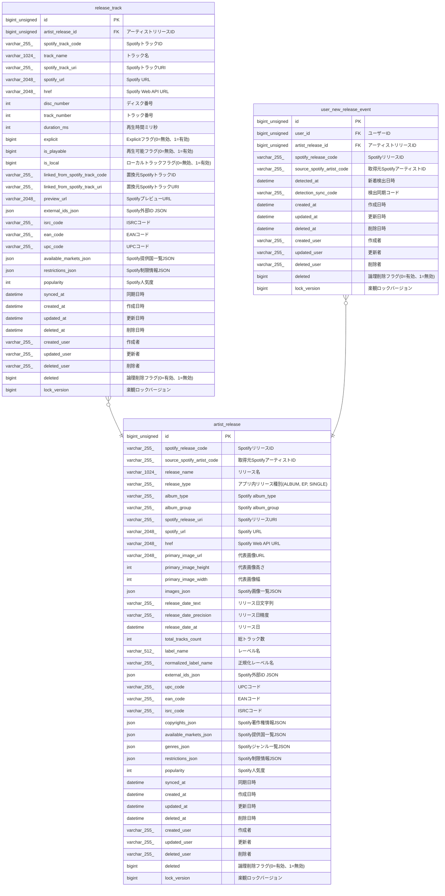

# release_track

## Description

リリーストラック

<details>
<summary><strong>Table Definition</strong></summary>

```sql
CREATE TABLE `release_track` (
  `id` bigint unsigned NOT NULL AUTO_INCREMENT,
  `artist_release_id` bigint unsigned NOT NULL COMMENT 'アーティストリリースID',
  `spotify_track_code` varchar(255) COLLATE utf8mb4_unicode_ci NOT NULL COMMENT 'SpotifyトラックID',
  `track_name` varchar(1024) COLLATE utf8mb4_unicode_ci NOT NULL DEFAULT '' COMMENT 'トラック名',
  `spotify_track_uri` varchar(255) COLLATE utf8mb4_unicode_ci NOT NULL DEFAULT '' COMMENT 'SpotifyトラックURI',
  `spotify_url` varchar(2048) COLLATE utf8mb4_unicode_ci NOT NULL DEFAULT '' COMMENT 'Spotify URL',
  `href` varchar(2048) COLLATE utf8mb4_unicode_ci NOT NULL DEFAULT '' COMMENT 'Spotify Web API URL',
  `disc_number` int NOT NULL DEFAULT '0' COMMENT 'ディスク番号',
  `track_number` int NOT NULL DEFAULT '0' COMMENT 'トラック番号',
  `duration_ms` int DEFAULT NULL COMMENT '再生時間ミリ秒',
  `explicit` bigint DEFAULT NULL COMMENT 'Explicitフラグ(0=無効、1=有効)',
  `is_playable` bigint DEFAULT NULL COMMENT '再生可能フラグ(0=無効、1=有効)',
  `is_local` bigint DEFAULT NULL COMMENT 'ローカルトラックフラグ(0=無効、1=有効)',
  `linked_from_spotify_track_code` varchar(255) COLLATE utf8mb4_unicode_ci DEFAULT NULL COMMENT '置換元SpotifyトラックID',
  `linked_from_spotify_track_uri` varchar(255) COLLATE utf8mb4_unicode_ci DEFAULT NULL COMMENT '置換元SpotifyトラックURI',
  `preview_url` varchar(2048) COLLATE utf8mb4_unicode_ci DEFAULT NULL COMMENT 'SpotifyプレビューURL',
  `external_ids_json` json DEFAULT NULL COMMENT 'Spotify外部ID JSON',
  `isrc_code` varchar(255) COLLATE utf8mb4_unicode_ci DEFAULT NULL COMMENT 'ISRCコード',
  `ean_code` varchar(255) COLLATE utf8mb4_unicode_ci DEFAULT NULL COMMENT 'EANコード',
  `upc_code` varchar(255) COLLATE utf8mb4_unicode_ci DEFAULT NULL COMMENT 'UPCコード',
  `available_markets_json` json DEFAULT NULL COMMENT 'Spotify提供国一覧JSON',
  `restrictions_json` json DEFAULT NULL COMMENT 'Spotify制限情報JSON',
  `popularity` int DEFAULT NULL COMMENT 'Spotify人気度',
  `synced_at` datetime DEFAULT NULL COMMENT '同期日時',
  `created_at` datetime NOT NULL COMMENT '作成日時',
  `updated_at` datetime NOT NULL COMMENT '更新日時',
  `deleted_at` datetime DEFAULT NULL COMMENT '削除日時',
  `created_user` varchar(255) COLLATE utf8mb4_unicode_ci NOT NULL COMMENT '作成者',
  `updated_user` varchar(255) COLLATE utf8mb4_unicode_ci NOT NULL COMMENT '更新者',
  `deleted_user` varchar(255) COLLATE utf8mb4_unicode_ci NOT NULL DEFAULT '' COMMENT '削除者',
  `deleted` bigint NOT NULL DEFAULT '0' COMMENT '論理削除フラグ(0=有効、1=無効)',
  `lock_version` bigint NOT NULL DEFAULT '0' COMMENT '楽観ロックバージョン',
  PRIMARY KEY (`id`),
  UNIQUE KEY `id` (`id`),
  UNIQUE KEY `uq_release_track_release_track` (`artist_release_id`,`spotify_track_code`),
  KEY `idx_release_track_track_code` (`spotify_track_code`),
  KEY `idx_release_track_order` (`artist_release_id`,`disc_number`,`track_number`),
  CONSTRAINT `fk_release_track_artist_release_id` FOREIGN KEY (`artist_release_id`) REFERENCES `artist_release` (`id`)
) ENGINE=InnoDB DEFAULT CHARSET=utf8mb4 COLLATE=utf8mb4_unicode_ci COMMENT='リリーストラック'
```

</details>

## Columns

| Name | Type | Default | Nullable | Extra Definition | Children | Parents | Comment |
| ---- | ---- | ------- | -------- | ---------------- | -------- | ------- | ------- |
| id | bigint unsigned |  | false | auto_increment |  |  |  |
| artist_release_id | bigint unsigned |  | false |  |  | [artist_release](artist_release.md) | アーティストリリースID |
| spotify_track_code | varchar(255) |  | false |  |  |  | SpotifyトラックID |
| track_name | varchar(1024) |  | false |  |  |  | トラック名 |
| spotify_track_uri | varchar(255) |  | false |  |  |  | SpotifyトラックURI |
| spotify_url | varchar(2048) |  | false |  |  |  | Spotify URL |
| href | varchar(2048) |  | false |  |  |  | Spotify Web API URL |
| disc_number | int | 0 | false |  |  |  | ディスク番号 |
| track_number | int | 0 | false |  |  |  | トラック番号 |
| duration_ms | int |  | true |  |  |  | 再生時間ミリ秒 |
| explicit | bigint |  | true |  |  |  | Explicitフラグ(0=無効、1=有効) |
| is_playable | bigint |  | true |  |  |  | 再生可能フラグ(0=無効、1=有効) |
| is_local | bigint |  | true |  |  |  | ローカルトラックフラグ(0=無効、1=有効) |
| linked_from_spotify_track_code | varchar(255) |  | true |  |  |  | 置換元SpotifyトラックID |
| linked_from_spotify_track_uri | varchar(255) |  | true |  |  |  | 置換元SpotifyトラックURI |
| preview_url | varchar(2048) |  | true |  |  |  | SpotifyプレビューURL |
| external_ids_json | json |  | true |  |  |  | Spotify外部ID JSON |
| isrc_code | varchar(255) |  | true |  |  |  | ISRCコード |
| ean_code | varchar(255) |  | true |  |  |  | EANコード |
| upc_code | varchar(255) |  | true |  |  |  | UPCコード |
| available_markets_json | json |  | true |  |  |  | Spotify提供国一覧JSON |
| restrictions_json | json |  | true |  |  |  | Spotify制限情報JSON |
| popularity | int |  | true |  |  |  | Spotify人気度 |
| synced_at | datetime |  | true |  |  |  | 同期日時 |
| created_at | datetime |  | false |  |  |  | 作成日時 |
| updated_at | datetime |  | false |  |  |  | 更新日時 |
| deleted_at | datetime |  | true |  |  |  | 削除日時 |
| created_user | varchar(255) |  | false |  |  |  | 作成者 |
| updated_user | varchar(255) |  | false |  |  |  | 更新者 |
| deleted_user | varchar(255) |  | false |  |  |  | 削除者 |
| deleted | bigint | 0 | false |  |  |  | 論理削除フラグ(0=有効、1=無効) |
| lock_version | bigint | 0 | false |  |  |  | 楽観ロックバージョン |

## Constraints

| Name | Type | Definition |
| ---- | ---- | ---------- |
| fk_release_track_artist_release_id | FOREIGN KEY | FOREIGN KEY (artist_release_id) REFERENCES artist_release (id) |
| id | UNIQUE | UNIQUE KEY id (id) |
| PRIMARY | PRIMARY KEY | PRIMARY KEY (id) |
| uq_release_track_release_track | UNIQUE | UNIQUE KEY uq_release_track_release_track (artist_release_id, spotify_track_code) |

## Indexes

| Name | Definition |
| ---- | ---------- |
| idx_release_track_order | KEY idx_release_track_order (artist_release_id, disc_number, track_number) USING BTREE |
| idx_release_track_track_code | KEY idx_release_track_track_code (spotify_track_code) USING BTREE |
| PRIMARY | PRIMARY KEY (id) USING BTREE |
| id | UNIQUE KEY id (id) USING BTREE |
| uq_release_track_release_track | UNIQUE KEY uq_release_track_release_track (artist_release_id, spotify_track_code) USING BTREE |

## Relations



---

> Generated by [tbls](https://github.com/k1LoW/tbls)
