# user_spotify_authorization

## Description

ユーザーSpotify認可情報

<details>
<summary><strong>Table Definition</strong></summary>

```sql
CREATE TABLE `user_spotify_authorization` (
  `id` bigint unsigned NOT NULL AUTO_INCREMENT,
  `user_id` bigint unsigned NOT NULL COMMENT 'ユーザーID',
  `scope_text` text COLLATE utf8mb4_unicode_ci NOT NULL COMMENT '認可スコープ',
  `access_token_cipher` varbinary(4096) NOT NULL COMMENT '暗号化アクセストークン',
  `access_token_nonce` varbinary(12) NOT NULL COMMENT 'アクセストークンNonce',
  `access_token_tag` varbinary(16) NOT NULL COMMENT 'アクセストークン認証タグ',
  `refresh_token_cipher` varbinary(4096) NOT NULL COMMENT '暗号化リフレッシュトークン',
  `refresh_token_nonce` varbinary(12) NOT NULL COMMENT 'リフレッシュトークンNonce',
  `refresh_token_tag` varbinary(16) NOT NULL COMMENT 'リフレッシュトークン認証タグ',
  `encryption_algorithm` varchar(255) COLLATE utf8mb4_unicode_ci NOT NULL COMMENT '暗号化方式',
  `encryption_key_version` varchar(255) COLLATE utf8mb4_unicode_ci NOT NULL COMMENT '暗号化キーバージョン',
  `token_type` varchar(255) COLLATE utf8mb4_unicode_ci NOT NULL COMMENT 'トークン種別',
  `access_token_expires_at` datetime NOT NULL COMMENT 'アクセストークン失効日時',
  `refresh_margin_seconds` int NOT NULL DEFAULT '300' COMMENT '期限前更新猶予秒',
  `last_authorized_at` datetime DEFAULT NULL COMMENT '最終認可日時',
  `last_refreshed_at` datetime DEFAULT NULL COMMENT '最終更新日時',
  `created_at` datetime NOT NULL COMMENT '作成日時',
  `updated_at` datetime NOT NULL COMMENT '更新日時',
  `deleted_at` datetime DEFAULT NULL COMMENT '削除日時',
  `created_user` varchar(255) COLLATE utf8mb4_unicode_ci NOT NULL COMMENT '作成者',
  `updated_user` varchar(255) COLLATE utf8mb4_unicode_ci NOT NULL COMMENT '更新者',
  `deleted_user` varchar(255) COLLATE utf8mb4_unicode_ci NOT NULL DEFAULT '' COMMENT '削除者',
  `deleted` bigint NOT NULL DEFAULT '0' COMMENT '論理削除フラグ(0=有効、1=無効)',
  `lock_version` bigint NOT NULL DEFAULT '0' COMMENT '楽観ロックバージョン',
  PRIMARY KEY (`id`),
  UNIQUE KEY `id` (`id`),
  UNIQUE KEY `uq_user_spotify_authorization_user_id` (`user_id`),
  CONSTRAINT `fk_user_spotify_authorization_user_id` FOREIGN KEY (`user_id`) REFERENCES `user` (`id`)
) ENGINE=InnoDB DEFAULT CHARSET=utf8mb4 COLLATE=utf8mb4_unicode_ci COMMENT='ユーザーSpotify認可情報'
```

</details>

## Columns

| Name | Type | Default | Nullable | Extra Definition | Children | Parents | Comment |
| ---- | ---- | ------- | -------- | ---------------- | -------- | ------- | ------- |
| id | bigint unsigned |  | false | auto_increment | [user_spotify_authorization_refresh_queue](user_spotify_authorization_refresh_queue.md) |  |  |
| user_id | bigint unsigned |  | false |  |  | [user](user.md) | ユーザーID |
| scope_text | text |  | false |  |  |  | 認可スコープ |
| access_token_cipher | varbinary(4096) |  | false |  |  |  | 暗号化アクセストークン |
| access_token_nonce | varbinary(12) |  | false |  |  |  | アクセストークンNonce |
| access_token_tag | varbinary(16) |  | false |  |  |  | アクセストークン認証タグ |
| refresh_token_cipher | varbinary(4096) |  | false |  |  |  | 暗号化リフレッシュトークン |
| refresh_token_nonce | varbinary(12) |  | false |  |  |  | リフレッシュトークンNonce |
| refresh_token_tag | varbinary(16) |  | false |  |  |  | リフレッシュトークン認証タグ |
| encryption_algorithm | varchar(255) |  | false |  |  |  | 暗号化方式 |
| encryption_key_version | varchar(255) |  | false |  |  |  | 暗号化キーバージョン |
| token_type | varchar(255) |  | false |  |  |  | トークン種別 |
| access_token_expires_at | datetime |  | false |  |  |  | アクセストークン失効日時 |
| refresh_margin_seconds | int | 300 | false |  |  |  | 期限前更新猶予秒 |
| last_authorized_at | datetime |  | true |  |  |  | 最終認可日時 |
| last_refreshed_at | datetime |  | true |  |  |  | 最終更新日時 |
| created_at | datetime |  | false |  |  |  | 作成日時 |
| updated_at | datetime |  | false |  |  |  | 更新日時 |
| deleted_at | datetime |  | true |  |  |  | 削除日時 |
| created_user | varchar(255) |  | false |  |  |  | 作成者 |
| updated_user | varchar(255) |  | false |  |  |  | 更新者 |
| deleted_user | varchar(255) |  | false |  |  |  | 削除者 |
| deleted | bigint | 0 | false |  |  |  | 論理削除フラグ(0=有効、1=無効) |
| lock_version | bigint | 0 | false |  |  |  | 楽観ロックバージョン |

## Constraints

| Name | Type | Definition |
| ---- | ---- | ---------- |
| fk_user_spotify_authorization_user_id | FOREIGN KEY | FOREIGN KEY (user_id) REFERENCES user (id) |
| id | UNIQUE | UNIQUE KEY id (id) |
| PRIMARY | PRIMARY KEY | PRIMARY KEY (id) |
| uq_user_spotify_authorization_user_id | UNIQUE | UNIQUE KEY uq_user_spotify_authorization_user_id (user_id) |

## Indexes

| Name | Definition |
| ---- | ---------- |
| PRIMARY | PRIMARY KEY (id) USING BTREE |
| id | UNIQUE KEY id (id) USING BTREE |
| uq_user_spotify_authorization_user_id | UNIQUE KEY uq_user_spotify_authorization_user_id (user_id) USING BTREE |

## Relations

```mermaid
erDiagram

"user_spotify_authorization_refresh_queue" |o--|| "user_spotify_authorization" : ""
"user_spotify_authorization" |o--|| "user" : ""
"blocked_label" }o--|| "user" : ""
"followed_artist_sync_queue" }o--|| "user" : ""
"user_followed_artist" }o--|| "user" : ""
"user_new_release_event" }o--|| "user" : ""
"user_session_token" }o--|| "user" : ""
"user_spotify_auth" |o--|| "user" : ""

"user_spotify_authorization" {
  bigint_unsigned id PK ""
  bigint_unsigned user_id FK "ユーザーID"
  text scope_text "認可スコープ"
  varbinary_4096_ access_token_cipher "暗号化アクセストークン"
  varbinary_12_ access_token_nonce "アクセストークンNonce"
  varbinary_16_ access_token_tag "アクセストークン認証タグ"
  varbinary_4096_ refresh_token_cipher "暗号化リフレッシュトークン"
  varbinary_12_ refresh_token_nonce "リフレッシュトークンNonce"
  varbinary_16_ refresh_token_tag "リフレッシュトークン認証タグ"
  varchar_255_ encryption_algorithm "暗号化方式"
  varchar_255_ encryption_key_version "暗号化キーバージョン"
  varchar_255_ token_type "トークン種別"
  datetime access_token_expires_at "アクセストークン失効日時"
  int refresh_margin_seconds "期限前更新猶予秒"
  datetime last_authorized_at "最終認可日時"
  datetime last_refreshed_at "最終更新日時"
  datetime created_at "作成日時"
  datetime updated_at "更新日時"
  datetime deleted_at "削除日時"
  varchar_255_ created_user "作成者"
  varchar_255_ updated_user "更新者"
  varchar_255_ deleted_user "削除者"
  bigint deleted "論理削除フラグ(0=有効、1=無効)"
  bigint lock_version "楽観ロックバージョン"
}
"user_spotify_authorization_refresh_queue" {
  bigint_unsigned id PK ""
  bigint_unsigned authorization_id FK "Spotify認可情報ID"
  varchar_255_ status "キュー状態(SCHEDULED, PROCESSING, SUCCEEDED, FAILED, BLOCKED, SKIPPED)"
  datetime next_attempt_at "次回試行日時"
  int attempt_count "試行回数"
  datetime last_failed_at "最終失敗日時"
  varchar_255_ last_error_type "最終エラー種別"
  varchar_255_ lock_token "処理ロックトークン"
  datetime locked_until "処理ロック期限"
  datetime last_attempted_at "最終試行日時"
  datetime completed_at "処理完了日時"
  datetime created_at "作成日時"
  datetime updated_at "更新日時"
  datetime deleted_at "削除日時"
  varchar_255_ created_user "作成者"
  varchar_255_ updated_user "更新者"
  varchar_255_ deleted_user "削除者"
  bigint deleted "論理削除フラグ(0=有効、1=無効)"
  bigint lock_version "楽観ロックバージョン"
}
"user" {
  bigint_unsigned id PK ""
  varchar_255_ user_name "ユーザー名"
  varchar_255_ display_name "表示名"
  varchar_255_ time_zone "タイムゾーン"
  bigint enabled "有効フラグ(0=無効、1=有効)"
  datetime created_at "作成日時"
  datetime updated_at "更新日時"
  datetime deleted_at "削除日時"
  varchar_255_ created_user "作成者"
  varchar_255_ updated_user "更新者"
  varchar_255_ deleted_user "削除者"
  bigint deleted "論理削除フラグ(0=有効、1=無効)"
  bigint lock_version "楽観ロックバージョン"
}
"blocked_label" {
  bigint_unsigned id PK ""
  bigint_unsigned user_id FK "ユーザーID"
  varchar_512_ label_name "レーベル名"
  varchar_255_ normalized_label_name "正規化レーベル名"
  text reason_text "理由"
  bigint enabled "有効フラグ(0=無効、1=有効)"
  datetime created_at "作成日時"
  datetime updated_at "更新日時"
  datetime deleted_at "削除日時"
  varchar_255_ created_user "作成者"
  varchar_255_ updated_user "更新者"
  varchar_255_ deleted_user "削除者"
  bigint deleted "論理削除フラグ(0=有効、1=無効)"
  bigint lock_version "楽観ロックバージョン"
}
"followed_artist_sync_queue" {
  bigint_unsigned id PK ""
  bigint_unsigned user_id FK "ユーザーID"
  date sync_date "同期対象日"
  varchar_255_ status "キュー状態(SCHEDULED, PROCESSING, SUCCEEDED, FAILED, BLOCKED, SKIPPED)"
  int requested_limit "Spotify API取得件数"
  varchar_255_ after_cursor "次ページ取得用afterカーソル"
  datetime next_attempt_at "次回試行日時"
  datetime last_attempted_at "最終試行日時"
  datetime completed_at "処理完了日時"
  int attempt_count "試行回数"
  datetime last_failed_at "最終失敗日時"
  varchar_255_ last_error_type "最終エラー種別"
  varchar_255_ lock_token "処理ロックトークン"
  datetime locked_until "処理ロック期限"
  datetime created_at "作成日時"
  datetime updated_at "更新日時"
  datetime deleted_at "削除日時"
  varchar_255_ created_user "作成者"
  varchar_255_ updated_user "更新者"
  varchar_255_ deleted_user "削除者"
  bigint deleted "論理削除フラグ(0=有効、1=無効)"
  bigint lock_version "楽観ロックバージョン"
}
"user_followed_artist" {
  bigint_unsigned id PK ""
  bigint_unsigned user_id FK "ユーザーID"
  varchar_255_ spotify_artist_code "SpotifyアーティストID"
  varchar_512_ artist_name "アーティスト名"
  varchar_255_ spotify_artist_uri "SpotifyアーティストURI"
  varchar_2048_ spotify_url "Spotify URL"
  varchar_2048_ href "Spotify Web API URL"
  varchar_2048_ primary_image_url "代表画像URL"
  int primary_image_height "代表画像高さ"
  int primary_image_width "代表画像幅"
  json images_json "Spotify画像一覧JSON"
  json genres_json "Spotifyジャンル一覧JSON"
  bigint followers_total "Spotifyフォロワー数"
  int popularity "Spotify人気度"
  datetime first_followed_at "初回フォロー検出日時"
  datetime last_seen_at "最終検出日時"
  datetime last_synced_at "最終同期日時"
  datetime created_at "作成日時"
  datetime updated_at "更新日時"
  datetime deleted_at "削除日時"
  varchar_255_ created_user "作成者"
  varchar_255_ updated_user "更新者"
  varchar_255_ deleted_user "削除者"
  bigint deleted "論理削除フラグ(0=有効、1=無効)"
  bigint lock_version "楽観ロックバージョン"
}
"user_new_release_event" {
  bigint_unsigned id PK ""
  bigint_unsigned user_id FK "ユーザーID"
  bigint_unsigned artist_release_id FK "アーティストリリースID"
  varchar_255_ spotify_release_code "SpotifyリリースID"
  varchar_255_ source_spotify_artist_code "取得元SpotifyアーティストID"
  datetime detected_at "新着検出日時"
  varchar_255_ detection_sync_code "検出同期コード"
  datetime created_at "作成日時"
  datetime updated_at "更新日時"
  datetime deleted_at "削除日時"
  varchar_255_ created_user "作成者"
  varchar_255_ updated_user "更新者"
  varchar_255_ deleted_user "削除者"
  bigint deleted "論理削除フラグ(0=有効、1=無効)"
  bigint lock_version "楽観ロックバージョン"
}
"user_session_token" {
  bigint_unsigned id PK ""
  bigint_unsigned user_id FK "ユーザーID"
  varchar_255_ hashed_token "セッショントークンのハッシュ値"
  datetime issued_at "トークン発行日時"
  datetime last_accessed_at "最終アクセス日時"
  datetime idle_expires_at "アイドルタイムアウト日時"
  datetime expires_at "トークン有効期限日時"
  datetime created_at "作成日時"
  datetime updated_at "更新日時"
  datetime deleted_at "削除日時"
  varchar_255_ created_user "作成者"
  varchar_255_ updated_user "更新者"
  varchar_255_ deleted_user "削除者"
  bigint deleted "論理削除フラグ(0=有効、1=無効)"
  bigint lock_version "楽観ロックバージョン"
}
"user_spotify_auth" {
  bigint_unsigned id PK ""
  bigint_unsigned user_id FK "ユーザーID"
  varchar_255_ spotify_user_id "SpotifyユーザーID"
  datetime created_at "作成日時"
  datetime updated_at "更新日時"
  datetime deleted_at "削除日時"
  varchar_255_ created_user "作成者"
  varchar_255_ updated_user "更新者"
  varchar_255_ deleted_user "削除者"
  bigint deleted "論理削除フラグ(0=有効、1=無効)"
  bigint lock_version "楽観ロックバージョン"
}
```



---

> Generated by [tbls](https://github.com/k1LoW/tbls)
