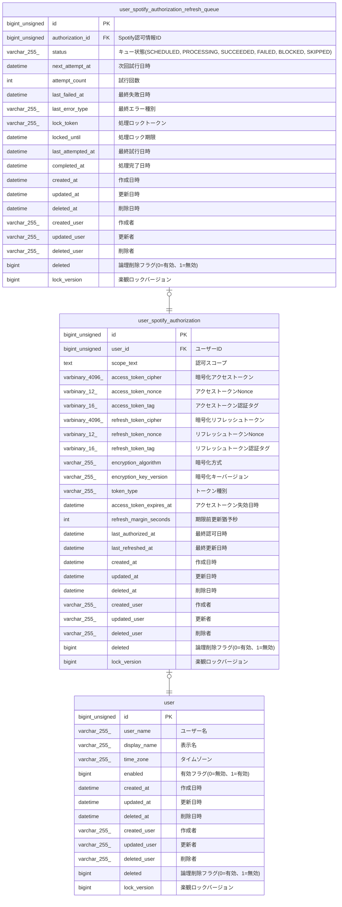

# user_spotify_authorization_refresh_queue

## Description

ユーザーSpotify認可更新キュー

<details>
<summary><strong>Table Definition</strong></summary>

```sql
CREATE TABLE `user_spotify_authorization_refresh_queue` (
  `id` bigint unsigned NOT NULL AUTO_INCREMENT,
  `authorization_id` bigint unsigned NOT NULL COMMENT 'Spotify認可情報ID',
  `status` varchar(255) COLLATE utf8mb4_unicode_ci NOT NULL DEFAULT 'SCHEDULED' COMMENT 'キュー状態(SCHEDULED, PROCESSING, SUCCEEDED, FAILED, BLOCKED, SKIPPED)',
  `next_attempt_at` datetime DEFAULT NULL COMMENT '次回試行日時',
  `attempt_count` int NOT NULL DEFAULT '0' COMMENT '試行回数',
  `last_failed_at` datetime DEFAULT NULL COMMENT '最終失敗日時',
  `last_error_type` varchar(255) COLLATE utf8mb4_unicode_ci NOT NULL DEFAULT '' COMMENT '最終エラー種別',
  `lock_token` varchar(255) COLLATE utf8mb4_unicode_ci NOT NULL DEFAULT '' COMMENT '処理ロックトークン',
  `locked_until` datetime DEFAULT NULL COMMENT '処理ロック期限',
  `last_attempted_at` datetime DEFAULT NULL COMMENT '最終試行日時',
  `completed_at` datetime DEFAULT NULL COMMENT '処理完了日時',
  `created_at` datetime NOT NULL COMMENT '作成日時',
  `updated_at` datetime NOT NULL COMMENT '更新日時',
  `deleted_at` datetime DEFAULT NULL COMMENT '削除日時',
  `created_user` varchar(255) COLLATE utf8mb4_unicode_ci NOT NULL COMMENT '作成者',
  `updated_user` varchar(255) COLLATE utf8mb4_unicode_ci NOT NULL COMMENT '更新者',
  `deleted_user` varchar(255) COLLATE utf8mb4_unicode_ci NOT NULL DEFAULT '' COMMENT '削除者',
  `deleted` bigint NOT NULL DEFAULT '0' COMMENT '論理削除フラグ(0=有効、1=無効)',
  `lock_version` bigint NOT NULL DEFAULT '0' COMMENT '楽観ロックバージョン',
  PRIMARY KEY (`id`),
  UNIQUE KEY `id` (`id`),
  UNIQUE KEY `uq_user_spotify_authorization_refresh_queue_authorization_id` (`authorization_id`),
  KEY `idx_user_spotify_authorization_refresh_queue_target` (`deleted`,`status`,`next_attempt_at`,`locked_until`,`id`),
  CONSTRAINT `fk_user_spotify_authorization_refresh_queue_authorization_id` FOREIGN KEY (`authorization_id`) REFERENCES `user_spotify_authorization` (`id`)
) ENGINE=InnoDB AUTO_INCREMENT=[Redacted by tbls] DEFAULT CHARSET=utf8mb4 COLLATE=utf8mb4_unicode_ci COMMENT='ユーザーSpotify認可更新キュー'
```

</details>

## Columns

| Name | Type | Default | Nullable | Extra Definition | Children | Parents | Comment |
| ---- | ---- | ------- | -------- | ---------------- | -------- | ------- | ------- |
| id | bigint unsigned |  | false | auto_increment |  |  |  |
| authorization_id | bigint unsigned |  | false |  |  | [user_spotify_authorization](user_spotify_authorization.md) | Spotify認可情報ID |
| status | varchar(255) | SCHEDULED | false |  |  |  | キュー状態(SCHEDULED, PROCESSING, SUCCEEDED, FAILED, BLOCKED, SKIPPED) |
| next_attempt_at | datetime |  | true |  |  |  | 次回試行日時 |
| attempt_count | int | 0 | false |  |  |  | 試行回数 |
| last_failed_at | datetime |  | true |  |  |  | 最終失敗日時 |
| last_error_type | varchar(255) |  | false |  |  |  | 最終エラー種別 |
| lock_token | varchar(255) |  | false |  |  |  | 処理ロックトークン |
| locked_until | datetime |  | true |  |  |  | 処理ロック期限 |
| last_attempted_at | datetime |  | true |  |  |  | 最終試行日時 |
| completed_at | datetime |  | true |  |  |  | 処理完了日時 |
| created_at | datetime |  | false |  |  |  | 作成日時 |
| updated_at | datetime |  | false |  |  |  | 更新日時 |
| deleted_at | datetime |  | true |  |  |  | 削除日時 |
| created_user | varchar(255) |  | false |  |  |  | 作成者 |
| updated_user | varchar(255) |  | false |  |  |  | 更新者 |
| deleted_user | varchar(255) |  | false |  |  |  | 削除者 |
| deleted | bigint | 0 | false |  |  |  | 論理削除フラグ(0=有効、1=無効) |
| lock_version | bigint | 0 | false |  |  |  | 楽観ロックバージョン |

## Constraints

| Name | Type | Definition |
| ---- | ---- | ---------- |
| fk_user_spotify_authorization_refresh_queue_authorization_id | FOREIGN KEY | FOREIGN KEY (authorization_id) REFERENCES user_spotify_authorization (id) |
| id | UNIQUE | UNIQUE KEY id (id) |
| PRIMARY | PRIMARY KEY | PRIMARY KEY (id) |
| uq_user_spotify_authorization_refresh_queue_authorization_id | UNIQUE | UNIQUE KEY uq_user_spotify_authorization_refresh_queue_authorization_id (authorization_id) |

## Indexes

| Name | Definition |
| ---- | ---------- |
| idx_user_spotify_authorization_refresh_queue_target | KEY idx_user_spotify_authorization_refresh_queue_target (deleted, status, next_attempt_at, locked_until, id) USING BTREE |
| PRIMARY | PRIMARY KEY (id) USING BTREE |
| id | UNIQUE KEY id (id) USING BTREE |
| uq_user_spotify_authorization_refresh_queue_authorization_id | UNIQUE KEY uq_user_spotify_authorization_refresh_queue_authorization_id (authorization_id) USING BTREE |

## Relations



---

> Generated by [tbls](https://github.com/k1LoW/tbls)
